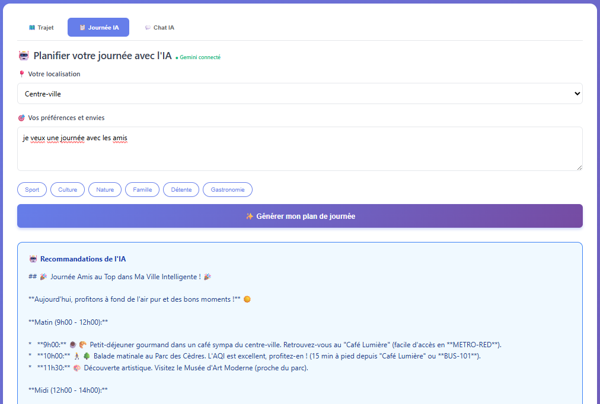
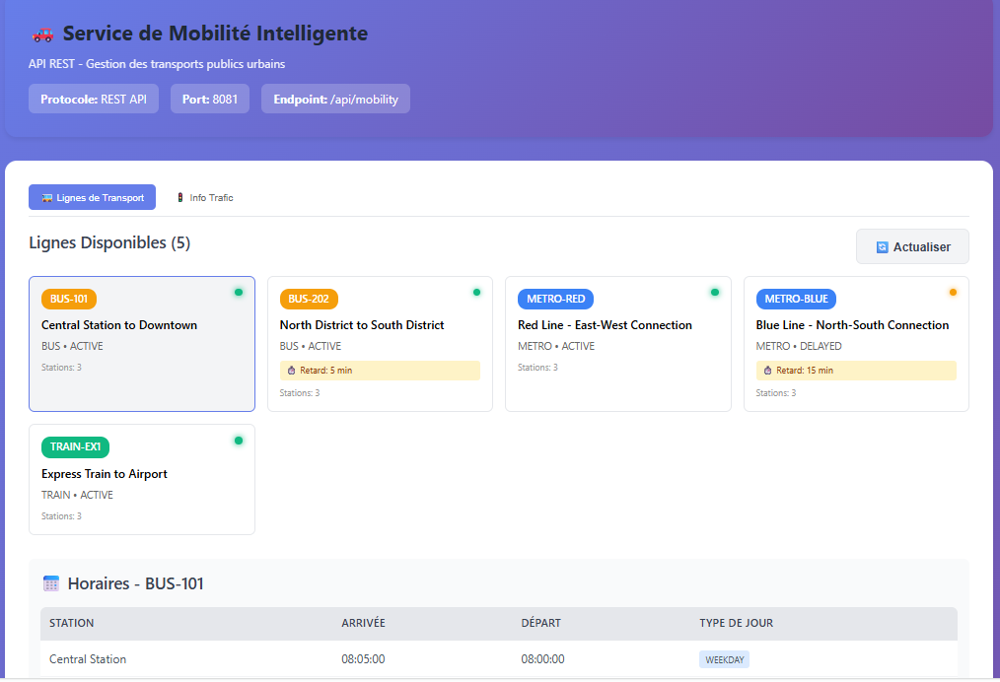
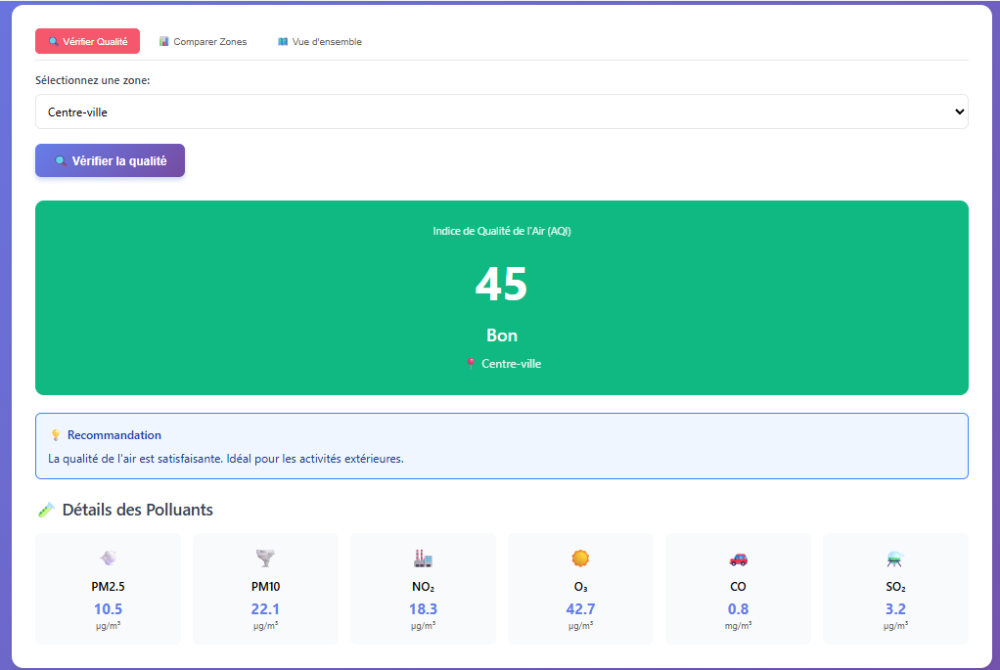
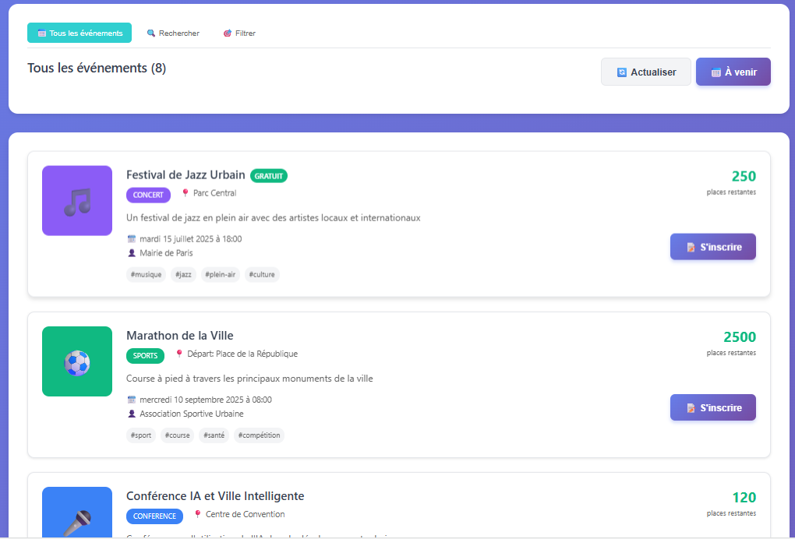
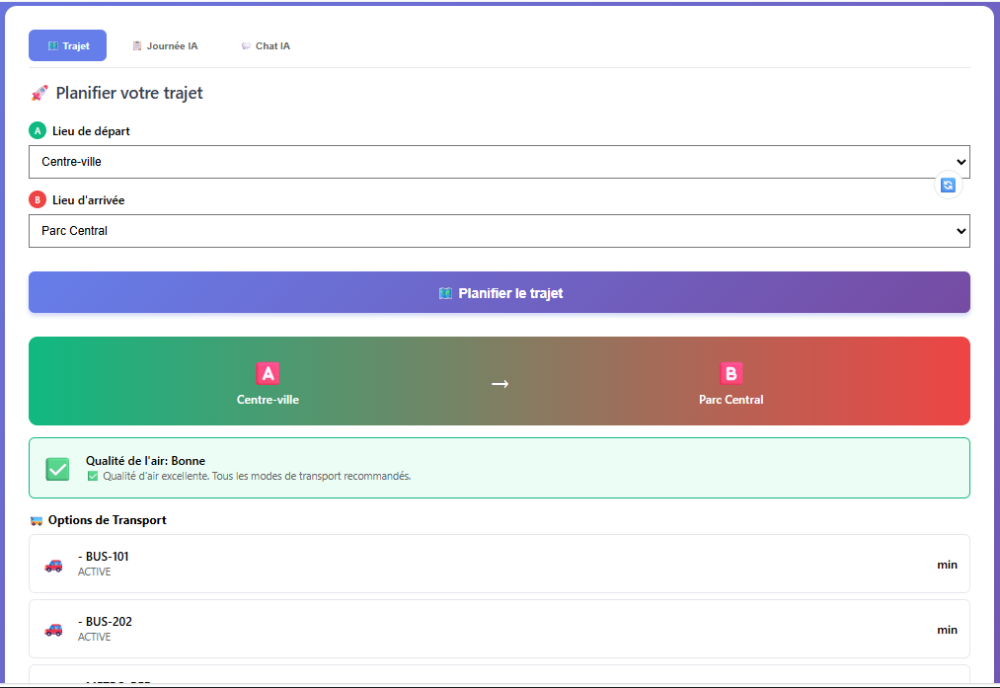

# Smart City Platform - Plateforme Ville Intelligente 🏙️

## 📋 Description

Plateforme microservices **intelligente** pour la gestion de services urbains utilisant 4 protocoles de communication différents et intégrant l'**Intelligence Artificielle Gemini** pour une assistance personnalisée :
- **REST** (Mobilité)
- **SOAP** (Qualité de l'Air)
- **gRPC** (Urgences)
- **GraphQL** (Événements Urbains)
- **🤖 IA Gemini** (Planification intelligente et assistance conversationnelle)

## ✨ Nouveautés - IA Gemini Intégrée

Cette plateforme intègre **Google Gemini 2.0 Flash** pour offrir :

### 🤖 Assistant IA Conversationnel
- **Chat intelligent** : Posez vos questions en langage naturel
- **Compréhension contextuelle** : L'IA connaît l'état actuel de la ville
- **Réponses personnalisées** : Basées sur vos préférences et la situation en temps réel

### 📋 Planification Intelligente de Journée
- **Plans personnalisés** : Créés automatiquement selon vos envies
- **Optimisation multi-critères** : Qualité d'air, transports, événements
- **Horaires intelligents** : Suggère les meilleurs moments pour chaque activité
- **Recommandations proactives** : Adaptées aux conditions météo et pollution

### 🔄 Interopérabilité IA + Microservices
- **Données en temps réel** : L'IA analyse les données de tous les services
- **Décisions contextuelles** : Prend en compte la qualité d'air, le trafic, les événements
- **Workflows intelligents** : Coordination automatique entre services

## 🖼️ Captures d'Écran

### 🏠 Dashboard Principal

*Vue d'ensemble de tous les services avec statut en temps réel*

### 🤖 Assistant IA - Chat Intelligent

*Conversation naturelle avec l'assistant Gemini pour obtenir des informations*

### 📋 Planification de Journée IA

*Plan de journée personnalisé généré par l'IA avec horaires et recommandations*

### 🚗 Service Mobilité (REST)

*Consultation des lignes de transport, horaires et info trafic*

### 🌫️ Service Qualité d'Air (SOAP)

*Vérification de la qualité d'air par zone avec indice AQI et polluants*

### 🚨 Service Urgences (gRPC)

*Création et gestion d'alertes d'urgence en temps réel*

### 🎭 Service Événements (GraphQL)

*Exploration flexible des événements urbains avec GraphQL*

### 🗺️ Planificateur de Trajet

*Planification intelligente de trajet avec analyse de qualité d'air*

---

## 🏗️ Architecture

```
┌─────────────────┐
│   Client Web    │ (Port 3000)
│     (React)     │
│  + Chat IA 🤖   │
└────────┬────────┘
         │
         ▼
┌─────────────────┐
│   API Gateway   │ (Port 8080)
└────────┬────────┘
         │
    ┌────┴────┬────────┬──────────┬────────────┐
    ▼         ▼        ▼          ▼            ▼
┌────────┐┌────────┐┌────────┐┌──────────┐┌──────────┐
│Mobility││AirQual.││Emerg.  ││Events    ││Orchestra.│
│(8081)  ││(8082)  ││(8083)  ││(8084)    ││(8085)    │
│REST    ││SOAP    ││gRPC    ││GraphQL   ││REST      │
└────────┘└────────┘└────────┘└──────────┘└─────┬────┘
                                                 │
                                                 ▼
                                          ┌─────────────┐
                                          │  Gemini AI  │
                                          │   (Cloud)   │
                                          │  🤖 GPT-4   │
                                          └─────────────┘
```

## 🚀 Installation et Démarrage Rapide

### Prérequis

- **Docker** >= 20.10
- **Docker Compose** >= 2.0
- **Java** 17 (pour développement local)
- **Maven** 3.9+ (pour développement local)
- **Node.js** 18+ (pour développement client)
- **🔑 Clé API Gemini** (optionnelle mais recommandée)

### 🤖 Configuration de l'IA Gemini (Optionnel)

Pour activer les fonctionnalités IA avancées :

1. **Obtenir une clé API Gemini** :
   - Visitez [Google AI Studio](https://makersuite.google.com/app/apikey)
   - Créez un compte Google (gratuit)
   - Générez une clé API

2. **Configurer la clé API** :

**Option A : Variables d'environnement (Recommandé)**
```bash
export GEMINI_API_KEY="votre-clé-api-ici"
export GEMINI_ENABLED=true
```

**Option B : Dans docker-compose.yml**
```yaml
orchestration-service:
  environment:
    - GEMINI_API_KEY=votre-clé-api-ici
    - GEMINI_ENABLED=true
```

**Note** : Sans clé API, le système fonctionnera en mode **fallback** avec des réponses basées sur des règles prédéfinies.

### Démarrage avec Docker Compose

1. **Cloner le projet**
```bash
git clone <repository-url>
cd smart-city-platform
```

2. **Construire et démarrer tous les services**
```bash
docker-compose up --build -d
```

3. **Attendre que tous les services soient prêts** (environ 2-3 minutes)
```bash
docker-compose ps
```

4. **Vérifier l'état des services**
```bash
# Santé de l'API Gateway
curl http://localhost:8080/actuator/health

# Santé du service d'orchestration avec IA
curl http://localhost:8085/orchestration/health
```

## 🌐 URLs d'Accès

### Client et Gateway
- **Client Web** : http://localhost:3000
- **💬 Chat IA** : Accessible depuis l'onglet "Chat IA" dans le client
- **📋 Planificateur IA** : Onglet "Planificateur" avec IA activée
- **API Gateway** : http://localhost:8080
- **Gateway Health** : http://localhost:8080/actuator/health

### Services
- **Mobilité** (REST) : http://localhost:8081/mobility
- **Qualité d'Air** (SOAP) : http://localhost:8082/airquality
- **Urgences** (gRPC/REST) : http://localhost:8083
- **Événements** (GraphQL) : http://localhost:8084
- **Orchestration + IA 🤖** : http://localhost:8085

### 🤖 Endpoints IA Gemini

#### Chat Conversationnel
```bash
POST http://localhost:8085/orchestration/chat
Content-Type: application/json

{
  "message": "Planifie-moi une journée sportive",
  "location": "Centre-ville"
}
```

#### Planification de Journée
```bash
POST http://localhost:8085/orchestration/plan-day?preferences=sport&location=Centre-ville
```

#### Test de Connexion IA
```bash
GET http://localhost:8085/orchestration/health
```

### Documentation & Outils
- **GraphiQL** (Events) : http://localhost:8084/graphiql
- **WSDL** (Air Quality) : http://localhost:8082/airquality/ws/airquality.wsdl
- **H2 Console** (Mobility) : http://localhost:8081/mobility/h2-console
- **Swagger UI** (Mobility) : http://localhost:8081/mobility/swagger-ui.html

## 🧪 Tests des Services

### Via le Client Web
Accédez à http://localhost:3000 et naviguez entre les différents services.

#### 🤖 Tester l'Assistant IA

1. **Chat Intelligent** :
   - Allez dans l'onglet "💬 Chat IA"
   - Posez des questions comme :
     - "Quelle est la qualité de l'air aujourd'hui ?"
     - "Planifie-moi une journée culturelle"
     - "Comment aller au Parc Central ?"

2. **Planification de Journée** :
   - Onglet "📋 Journée IA"
   - Entrez vos préférences : "sport, nature, famille"
   - Laissez l'IA générer un plan personnalisé
   - Utilisez les prompts rapides pour des suggestions

### Via API

**1. Mobilité (REST)**
```bash
curl http://localhost:8080/api/mobility/transport-lines
```

**2. Qualité d'Air (SOAP)**
```bash
curl -X POST http://localhost:8080/api/air-quality/ws \
  -H "Content-Type: text/xml" \
  -d '<soapenv:Envelope xmlns:soapenv="http://schemas.xmlsoap.org/soap/envelope/" xmlns:air="http://smartcity.com/airquality">
   <soapenv:Body>
      <air:GetAirQualityRequest>
         <air:zoneName>Centre-ville</air:zoneName>
      </air:GetAirQualityRequest>
   </soapenv:Body>
</soapenv:Envelope>'
```

**3. Urgences (gRPC)**
```bash
curl -X POST http://localhost:8080/api/emergency \
  -H "Content-Type: application/json" \
  -d '{
    "reporterId": "user123",
    "emergencyType": "FIRE",
    "severityLevel": "HIGH",
    "location": "Downtown",
    "latitude": 48.8566,
    "longitude": 2.3522,
    "description": "Building fire",
    "affectedPeople": 10
  }'
```

**4. Événements (GraphQL)**
```bash
curl -X POST http://localhost:8080/api/events/graphql \
  -H "Content-Type: application/json" \
  -d '{"query": "{ getAllEvents { id title location startDateTime } }"}'
```

**5. 🤖 Chat IA**
```bash
curl -X POST http://localhost:8085/orchestration/chat \
  -H "Content-Type: application/json" \
  -d '{
    "message": "Je veux une journée détente avec des activités culturelles",
    "location": "Centre-ville"
  }'
```

**6. 🤖 Planification IA**
```bash
curl -X POST "http://localhost:8085/orchestration/plan-day?preferences=sport,nature&location=Parc%20Central"
```

## 🛠️ Développement

### Structure du Projet
```
smart-city-platform/
├── api-gateway/              # API Gateway (Spring Cloud Gateway)
├── mobility-service/         # Service REST
├── air-quality-service/      # Service SOAP
├── emergency-service/        # Service gRPC
├── urban-events-service/     # Service GraphQL
├── orchestration-service/    # 🤖 Service d'orchestration + IA Gemini
│   ├── src/main/java/.../service/
│   │   ├── GeminiService.java        # Intégration Gemini
│   │   ├── DayPlannerService.java    # Planification IA
│   │   └── ...
│   └── src/main/resources/
│       └── application.yml           # Config Gemini
├── client-web/              # Client React avec UI IA
│   ├── src/components/
│   │   ├── JourneyPlanner.jsx        # UI Chat + Planning IA
│   │   └── ...
├── docs/
│   └── screenshots/         # 📸 Captures d'écran à ajouter ici
├── docker-compose.yml       # Configuration Docker
└── README.md               # Ce fichier
```

### 🤖 Développement avec IA

#### Configuration Locale
```yaml
# orchestration-service/src/main/resources/application.yml
gemini:
  api-key: ${GEMINI_API_KEY:}
  model: gemini-2.0-flash
  enabled: true
```

#### Tests IA
```bash
# Démarrer le service d'orchestration
cd orchestration-service
mvn spring-boot:run -Dspring-boot.run.arguments="--GEMINI_API_KEY=votre-clé"

# Tester le chat
curl -X POST http://localhost:8085/orchestration/chat \
  -H "Content-Type: application/json" \
  -d '{"message": "Bonjour!"}'
```

### Développement Local (sans Docker)

**Services backend** :
```bash
# Terminal 1 - Mobility
cd mobility-service && mvn spring-boot:run

# Terminal 2 - Air Quality
cd air-quality-service && mvn spring-boot:run

# Terminal 3 - Emergency
cd emergency-service && mvn spring-boot:run

# Terminal 4 - Events
cd urban-events-service && mvn spring-boot:run

# Terminal 5 - Orchestration (avec IA)
cd orchestration-service
export GEMINI_API_KEY="votre-clé"
mvn spring-boot:run

# Terminal 6 - API Gateway
cd api-gateway && mvn spring-boot:run
```

**Client web** :
```bash
cd client-web
npm install
npm run dev
```

## 🐛 Dépannage

### IA Gemini ne répond pas

**Vérifier la configuration** :
```bash
# Vérifier la santé du service
curl http://localhost:8085/orchestration/health

# Devrait retourner:
{
  "status": "UP",
  "gemini": {
    "enabled": true,
    "connected": true
  }
}
```

**Solutions** :
1. Vérifier que `GEMINI_API_KEY` est définie
2. Vérifier les quotas de l'API Gemini
3. Consulter les logs : `docker-compose logs orchestration-service`
4. Mode fallback : Le système fonctionne même sans IA

### Services ne démarrent pas

```bash
# Nettoyer et reconstruire
docker-compose down -v
docker system prune -a
docker-compose up --build -d
```

### Client web ne se connecte pas

```bash
# Vérifier l'API Gateway
curl http://localhost:8080/actuator/health

# Vérifier les logs
docker-compose logs api-gateway
docker-compose logs client-web
```

## 📊 Monitoring

### Logs en temps réel
```bash
# Tous les services
docker-compose logs -f

# Service spécifique
docker-compose logs -f orchestration-service

# Logs IA seulement
docker-compose logs -f orchestration-service | grep "Gemini"
```

## 🛑 Arrêt et Nettoyage

```bash
# Arrêter tous les services
docker-compose down

# Arrêter et supprimer les volumes
docker-compose down -v

# Nettoyage complet
docker-compose down -v
docker system prune -a
```

## 📝 Notes Importantes

1. **IA Gemini** : Fonctionnalité optionnelle mais fortement recommandée
2. **Clé API Gratuite** : Google offre un quota gratuit généreux
3. **Mode Fallback** : Le système fonctionne sans IA avec des règles prédéfinies
4. **Ordre de démarrage** : L'API Gateway attend que tous les services soient prêts
5. **Ports** : Assurez-vous que les ports 3000, 8080-8085, 9090 sont disponibles
6. **Mémoire** : Recommandé minimum 4GB RAM pour Docker
7. **Temps de démarrage** : Première construction peut prendre 5-10 minutes
8. **Healthchecks** : Les services ont des healthchecks automatiques

## 🎯 Fonctionnalités Clés

### 🤖 Intelligence Artificielle
- ✅ **Chat conversationnel** avec compréhension contextuelle
- ✅ **Planification automatique** de journées personnalisées
- ✅ **Recommandations intelligentes** basées sur les données en temps réel
- ✅ **Analyse multi-critères** (air, transport, événements)

### 🔄 Interopérabilité
- ✅ **4 protocoles** : REST, SOAP, gRPC, GraphQL
- ✅ **Orchestration** : Coordination automatique des services
- ✅ **API Gateway** : Point d'entrée unique
- ✅ **Microservices** : Architecture scalable

### 📊 Services Urbains
- ✅ **Mobilité** : Transports publics, horaires, trafic
- ✅ **Qualité d'Air** : Surveillance AQI et polluants
- ✅ **Urgences** : Gestion d'alertes temps réel
- ✅ **Événements** : Agenda culturel et communautaire

## 🔧 Configuration

### Variables d'Environnement IA

```bash
# Dans docker-compose.yml ou .env
GEMINI_API_KEY=your-api-key-here        # Clé API Gemini
GEMINI_MODEL=gemini-2.0-flash           # Modèle à utiliser
GEMINI_ENABLED=true                      # Activer/Désactiver l'IA
```

### Personnalisation

Voir les fichiers README.md individuels dans chaque service pour plus de détails.

## 📚 Documentation des Services

- [API Gateway](./api-gateway/README.md)
- [Mobility Service](./mobility-service/README.md)
- [Air Quality Service](./air-quality-service/README.md)
- [Emergency Service](./emergency-service/README.md)
- [Urban Events Service](./urban-events-service/README.md)
- [🤖 Orchestration Service + IA](./orchestration-service/README.md)
- [Client Web](./client-web/README.md)

## 🤝 Support

Pour tout problème:
1. Vérifier les logs: `docker-compose logs <service>`
2. Vérifier la section Dépannage ci-dessus
3. Pour l'IA : Vérifier la clé API et les quotas
4. Reconstruire: `docker-compose up --build -d`

## 🎓 Cas d'Usage IA

### Exemple 1 : Journée Sportive
```
Utilisateur : "Planifie-moi une journée sportive"
IA Gemini : 
  ✅ Analyse qualité d'air → Bon (AQI: 45)
  ✅ Trouve événements sportifs → Marathon au Parc Central
  ✅ Suggère transports → Metro ligne B
  ✅ Génère planning complet avec horaires
```

### Exemple 2 : Qualité d'Air
```
Utilisateur : "Est-ce que je peux faire du jogging dehors ?"
IA Gemini :
  ✅ Vérifie AQI en temps réel
  ✅ Analyse les polluants
  ✅ Recommande les meilleurs créneaux horaires
  ✅ Suggère les zones les moins polluées
```

### Exemple 3 : Exploration Événements
```
Utilisateur : "Que faire ce weekend ?"
IA Gemini :
  ✅ Liste les événements à venir
  ✅ Filtre selon vos préférences
  ✅ Suggère des itinéraires optimaux
  ✅ Prend en compte la qualité d'air et le trafic
```


## 📄 Licence

Ce projet est un exemple éducatif pour démontrer l'interopérabilité des microservices avec différents protocoles de communication et l'intégration d'Intelligence Artificielle.

---

**🏙️ Smart City Platform v2.0 - Edition IA**  
**📅 2025**